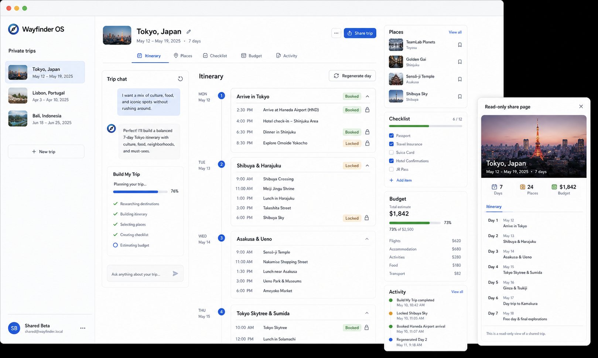

# Wayfinder OS



Wayfinder OS is an agentic travel planning workspace that turns messy trip conversations into structured itineraries, places, checklists, budgets, and shareable trip pages.

Current status: `v1.0.1 demo polish`

This frontend is the polished demo surface for Wayfinder OS. It is intentionally frozen as a demo and case-study artifact rather than being expanded into a larger commercial product at this stage.

## What It Does

Wayfinder OS gives each signed-in user a private travel planning workspace. Users can create trips, chat with a trip-aware assistant, run a structured "Build My Trip" workflow, review generated itinerary artifacts, lock or book specific items, regenerate weak days, and publish a read-only public share page.

## Key Features

- Public landing page for the product demo.
- Clerk-backed sign-in and protected private routes.
- Private trip dashboard with user-owned trips.
- Trip workspace with itinerary, places, checklist, budget, chat, and activity panels.
- Trip-aware chat that uses saved trip context and prior messages.
- Build My Trip workflow for generating itinerary days, saved places, checklist items, and budget notes.
- Editable itinerary item states, including locked and booked items.
- Day regeneration flow that preserves locked/booked items.
- Public read-only share pages at `/share/[shareSlug]`.
- Responsive UI for desktop and mobile workspace use.

## Screenshots And Demo

Demo link: add after deployment.

The generated overview image above is a README/case-study visual. Real product screenshots should be placed in `docs/screenshots/` using these names:

- `landing-page.png`
- `dashboard.png`
- `workspace-itinerary.png`
- `chat-planning-response.png`
- `build-my-trip-progress.png`
- `regenerate-day-flow.png`
- `public-share-page.png`
- `mobile-workspace.png`

See [docs/demo-script.md](docs/demo-script.md) for the walkthrough and [docs/screenshots/README.md](docs/screenshots/README.md) for capture notes.

## Architecture Overview

The frontend is a Next.js app that talks to the FastAPI backend over HTTP.

- `app/page.tsx` renders the public landing page.
- `app/trips/page.tsx` renders the authenticated trip dashboard.
- `app/trips/[tripId]/page.tsx` renders the authenticated workspace.
- `app/share/[shareSlug]/page.tsx` renders public read-only trip pages.
- `proxy.ts` uses Clerk middleware to protect private routes.
- `lib/api-client.ts` centralizes authenticated API calls, public share calls, streaming chat, and worker polling.
- `components/trip-workspace.tsx` owns the main workspace interaction loop.

The backend owns auth verification, persistence, OpenAI calls, Redis-backed async jobs, and public share payload shaping. See `../backend/README.md` for backend architecture notes.

## Tech Stack

- Next.js 16
- React 19
- TypeScript
- Clerk
- Tailwind CSS v4
- Lucide icons
- Netlify deployment config

## Local Setup

Install dependencies from the frontend repo:

```bash
cd frontend
npm install
cp .env.example .env
```

Set local frontend environment variables:

```bash
NEXT_PUBLIC_API_URL=http://localhost:8000
NEXT_PUBLIC_CLERK_PUBLISHABLE_KEY=<your_clerk_publishable_key>
```

Run the frontend:

```bash
npm run dev
```

The local app defaults to `http://localhost:3000`.

## Backend Dependency

The frontend expects the backend API to be running and reachable through `NEXT_PUBLIC_API_URL`.

For a full local demo, start:

1. PostgreSQL and Redis from the workspace root.
2. Backend API from `backend/`.
3. Backend worker from `backend/`.
4. Frontend dev server from `frontend/`.

The backend README contains the exact API, worker, Redis, and Alembic commands.

## Run Commands

```bash
npm run dev
npm run build
npm run start
npm run lint
npm run format
```

## Deployment Notes

This repo includes `netlify.toml`:

```toml
[build]
  command = "npm run build"
  publish = ".next"
```

Production deployment requires:

- `NEXT_PUBLIC_API_URL` pointing at the deployed backend API.
- `NEXT_PUBLIC_CLERK_PUBLISHABLE_KEY` from the matching Clerk application.
- Clerk allowed origins/routes configured for the deployed frontend domain.
- Backend CORS configured with the deployed frontend origin.

Do not expose backend secret keys in frontend environment variables.

## Known Limitations

- No billing, credits, or subscriptions yet.
- No collaboration or team workspaces yet.
- No Google Places/place enrichment yet.
- Generated plans should be reviewed before booking travel.
- No flight, hotel, or activity checkout.
- No native mobile app.
- Workflow quality depends on LLM output and the trip context provided.
- Public share pages are read-only.
- Real auth exists, but account/profile management is intentionally minimal.
- The current demo depends on the backend API, Redis worker, and OpenAI configuration being healthy.

## Security Notes

- Keep `.env` and `.env.local` out of git.
- Only `NEXT_PUBLIC_*` values belong in the frontend.
- Never place Clerk secret keys, OpenAI keys, database URLs, Redis credentials, Railway tokens, or Stripe keys in frontend files.
- Public share pages omit private chat history and expose only the public trip packet returned by the backend.

## Version History

- `v1.0.1 demo polish`: documentation, case study, demo script, screenshot guidance, setup notes, known limitations, and security/log hygiene pass.
- `v1.0`: polished demo surface with private trips, durable planning artifacts, async agent workflows, and public share pages.
- `v0.9`: v0 template frontend remake and product UX hardening.
- `v0.8`: Clerk-backed real auth and private user trip ownership.
- `v0.7`: async worker reliability and persistent agent events.
- `v0.6`: durable trip state with itinerary, places, checklist, and budget artifacts.
